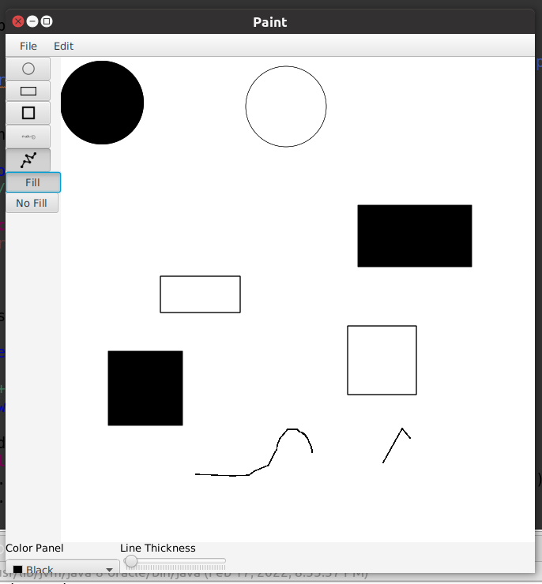
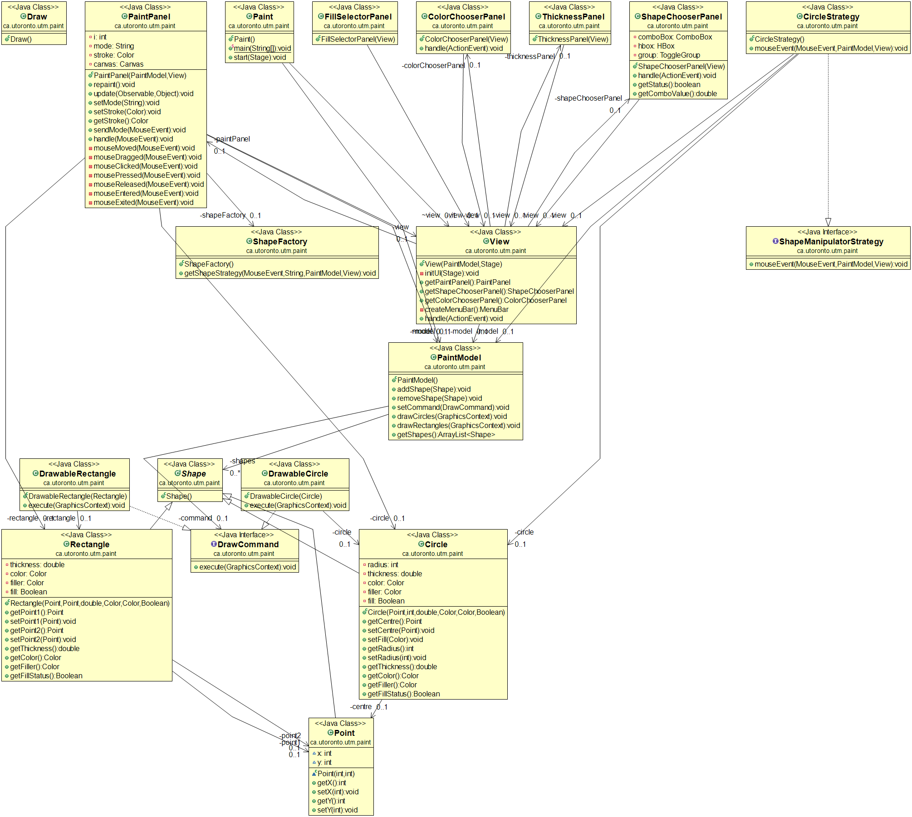

# Paint
Recreating MS Paint using Java

## Features included:
* Draw Circles
* Draw Quadilaterals
* Draw Squiggly lines
* Draw Polylines
* Change line thickness
* Change color
* For solid shapes, fill/no fill option offered

## Design model:

## Contributors:
* Sidharth Khurana
* Michael Skotar
* Danill Oliynyk
* Lucas Kamara
This project was created as part of an assignment for the class CSC207 for the year 2018 at Univerisity of Toronto Mississauga.
